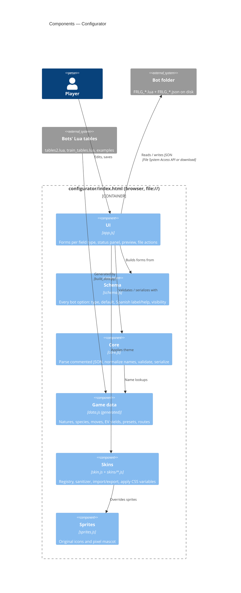

# C4 — Configurator components

> **AI-DLC phase:** `02-design`  ·  Level 3: inside `configurator/`.

```mermaid
C4Component
    title Components — Configurator

    Person(player, "Player")

    Container_Boundary(cfg, "configurator/index.html (browser, file://)") {
        Component(app, "UI", "app.js", "Forms per field type, status panel, preview, file actions")
        Component(schema, "Schema", "schema.js", "Every bot option: type, default, Spanish label/help, visibility")
        Component(core, "Core", "core.js", "Parse commented JSON, normalize names, validate, serialize")
        Component(data, "Game data", "data.js (generated)", "Natures, species, moves, EV yields, presets, routes")
        Component(skin, "Skins", "skin.js + skins/*.js", "Registry, sanitizer, import/export, apply CSS variables")
        Component(art, "Sprites", "sprites.js", "Original icons and pixel mascot")
    }

    System_Ext(fs, "Bot folder", "FRLG_*.lua + FRLG_*.json on disk")
    System_Ext(lua, "Bots' Lua tables", "tables2.lua, train_tables.lua, examples")

    Rel(player, app, "Edits, saves")
    Rel(app, schema, "Builds forms from")
    Rel(app, core, "Validates / serializes with")
    Rel(core, data, "Name lookups")
    Rel(app, skin, "Applies theme")
    Rel(skin, art, "Overrides sprites")
    Rel(app, fs, "Reads / writes JSON", "File System Access API or download")
    Rel(lua, data, "Generated by", "build_data.py")
```
