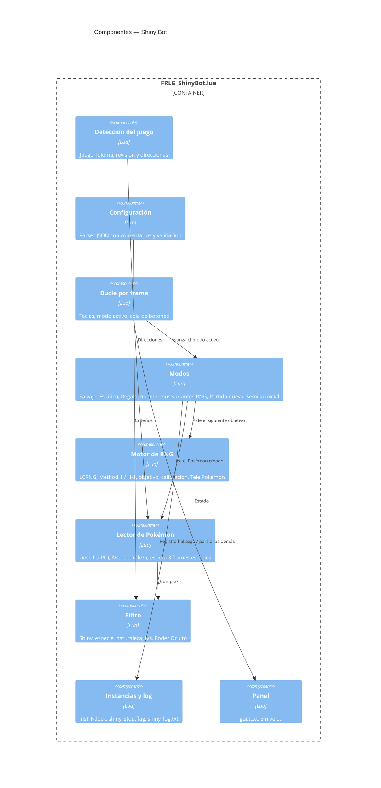

# C4 — Componentes del Shiny Bot

> **Fase AI-DLC:** `02-design`  ·  Nivel 3: dentro de `FRLG_ShinyBot.lua`.

```mermaid
C4Component
    title Componentes — Shiny Bot

    Container_Boundary(shiny, "FRLG_ShinyBot.lua") {
        Component(detect, "Detección del juego", "Lua", "Juego, idioma, revisión y direcciones")
        Component(config, "Configuración", "Lua", "Parser JSON con comentarios y validación")
        Component(loop, "Bucle por frame", "Lua", "Teclas, modo activo, cola de botones")
        Component(modes, "Modos", "Lua", "Salvaje, Estático, Regalo, Roamer, sus variantes RNG, Partida nueva, Semilla inicial")
        Component(rng, "Motor de RNG", "Lua", "LCRNG, Method 1 / H-1, objetivo, calibración, Tele Pokémon")
        Component(reader, "Lector de Pokémon", "Lua", "Descifra PID, IVs, naturaleza; espera 3 frames estables")
        Component(filter, "Filtro", "Lua", "Shiny, especie, naturaleza, IVs, Poder Oculto")
        Component(inst, "Instancias y log", "Lua", "inst_N.lock, shiny_stop.flag, shiny_log.txt")
        Component(panel, "Panel", "Lua", "gui.text, 3 niveles")
    }

    Rel(loop, modes, "Avanza el modo activo")
    Rel(modes, rng, "Pide el siguiente objetivo")
    Rel(modes, reader, "Lee el Pokémon creado")
    Rel(reader, filter, "¿Cumple?")
    Rel(modes, inst, "Registra hallazgo / para a las demás")
    Rel(detect, reader, "Direcciones")
    Rel(config, filter, "Criterios")
    Rel(loop, panel, "Estado")
```
