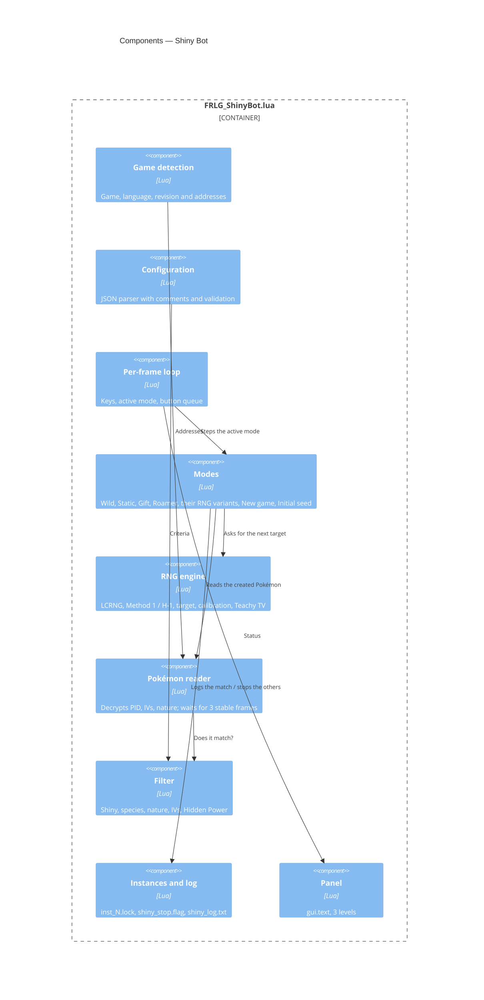

# C4 — Shiny Bot components

> **AI-DLC phase:** `02-design`  ·  Level 3: inside `FRLG_ShinyBot.lua`.

```mermaid
C4Component
    title Components — Shiny Bot

    Container_Boundary(shiny, "FRLG_ShinyBot.lua") {
        Component(detect, "Game detection", "Lua", "Game, language, revision and addresses")
        Component(config, "Configuration", "Lua", "JSON parser with comments and validation")
        Component(loop, "Per-frame loop", "Lua", "Keys, active mode, button queue")
        Component(modes, "Modes", "Lua", "Wild, Static, Gift, Roamer, their RNG variants, New game, Initial seed")
        Component(rng, "RNG engine", "Lua", "LCRNG, Method 1 / H-1, target, calibration, Teachy TV")
        Component(reader, "Pokémon reader", "Lua", "Decrypts PID, IVs, nature; waits for 3 stable frames")
        Component(filter, "Filter", "Lua", "Shiny, species, nature, IVs, Hidden Power")
        Component(inst, "Instances and log", "Lua", "inst_N.lock, shiny_stop.flag, shiny_log.txt")
        Component(panel, "Panel", "Lua", "gui.text, 3 levels")
    }

    Rel(loop, modes, "Steps the active mode")
    Rel(modes, rng, "Asks for the next target")
    Rel(modes, reader, "Reads the created Pokémon")
    Rel(reader, filter, "Does it match?")
    Rel(modes, inst, "Logs the match / stops the others")
    Rel(detect, reader, "Addresses")
    Rel(config, filter, "Criteria")
    Rel(loop, panel, "Status")
```
