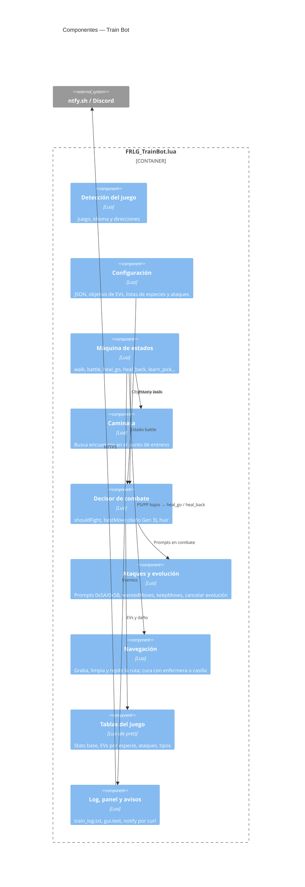

# C4 — Componentes del Train Bot

> **Fase AI-DLC:** `02-design`  ·  Nivel 3: dentro de `FRLG_TrainBot.lua`.

```mermaid
C4Component
    title Componentes — Train Bot

    Container_Boundary(train, "FRLG_TrainBot.lua") {
        Component(detect, "Detección del juego", "Lua", "Juego, idioma y direcciones")
        Component(config, "Configuración", "Lua", "JSON, objetivo de EVs, listas de especies y ataques")
        Component(loop, "Máquina de estados", "Lua", "walk, battle, heal_go, heal_back, learn_pick…")
        Component(walk, "Caminata", "Lua", "Busca encuentros en el punto de entreno")
        Component(fight, "Decisor de combate", "Lua", "shouldFight, bestMove (daño Gen 3), huir")
        Component(learn, "Ataques y evolución", "Lua", "Prompts 0x5A/0x5B, wantedMoves, keepMoves, cancelar evolución")
        Component(nav, "Navegación", "Lua", "Graba, limpia y repite la ruta; cura con enfermera o casilla")
        Component(tables, "Tablas del juego", "Lua (de pret)", "Stats base, EVs por especie, ataques, tipos")
        Component(out, "Log, panel y avisos", "Lua", "train_log.txt, gui.text, notify por curl")
    }

    System_Ext(notif, "ntfy.sh / Discord")

    Rel(loop, walk, "Estado walk")
    Rel(loop, fight, "Estado battle")
    Rel(fight, tables, "EVs y daño")
    Rel(fight, learn, "Prompts en combate")
    Rel(loop, nav, "PS/PP bajos → heal_go / heal_back")
    Rel(config, fight, "Objetivo y listas")
    Rel(loop, out, "Eventos")
    Rel(out, notif, "HTTPS")
```
