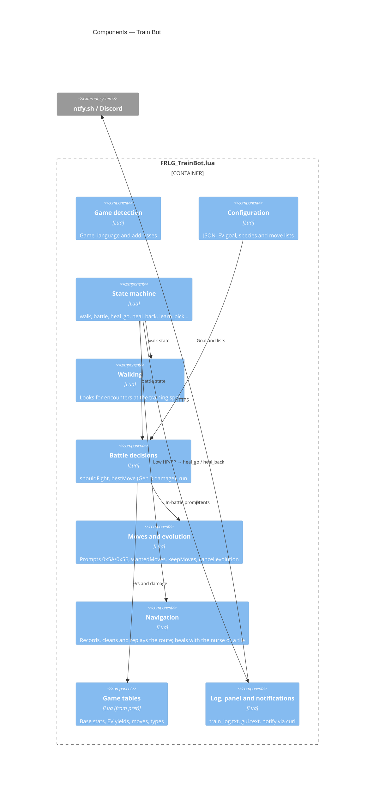

# C4 — Train Bot components

> **AI-DLC phase:** `02-design`  ·  Level 3: inside `FRLG_TrainBot.lua`.

```mermaid
C4Component
    title Components — Train Bot

    Container_Boundary(train, "FRLG_TrainBot.lua") {
        Component(detect, "Game detection", "Lua", "Game, language and addresses")
        Component(config, "Configuration", "Lua", "JSON, EV goal, species and move lists")
        Component(loop, "State machine", "Lua", "walk, battle, heal_go, heal_back, learn_pick…")
        Component(walk, "Walking", "Lua", "Looks for encounters at the training spot")
        Component(fight, "Battle decisions", "Lua", "shouldFight, bestMove (Gen 3 damage), run")
        Component(learn, "Moves and evolution", "Lua", "Prompts 0x5A/0x5B, wantedMoves, keepMoves, cancel evolution")
        Component(nav, "Navigation", "Lua", "Records, cleans and replays the route; heals with the nurse or a tile")
        Component(tables, "Game tables", "Lua (from pret)", "Base stats, EV yields, moves, types")
        Component(out, "Log, panel and notifications", "Lua", "train_log.txt, gui.text, notify via curl")
    }

    System_Ext(notif, "ntfy.sh / Discord")

    Rel(loop, walk, "walk state")
    Rel(loop, fight, "battle state")
    Rel(fight, tables, "EVs and damage")
    Rel(fight, learn, "In-battle prompts")
    Rel(loop, nav, "Low HP/PP → heal_go / heal_back")
    Rel(config, fight, "Goal and lists")
    Rel(loop, out, "Events")
    Rel(out, notif, "HTTPS")
```
